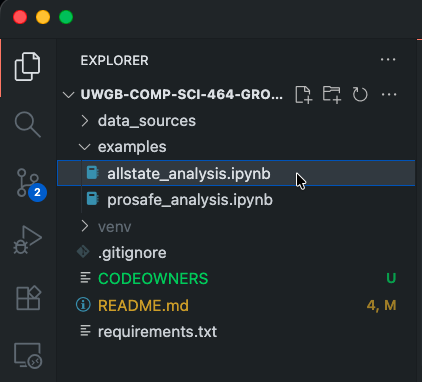
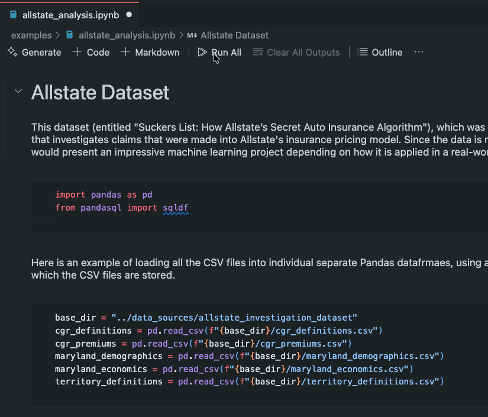
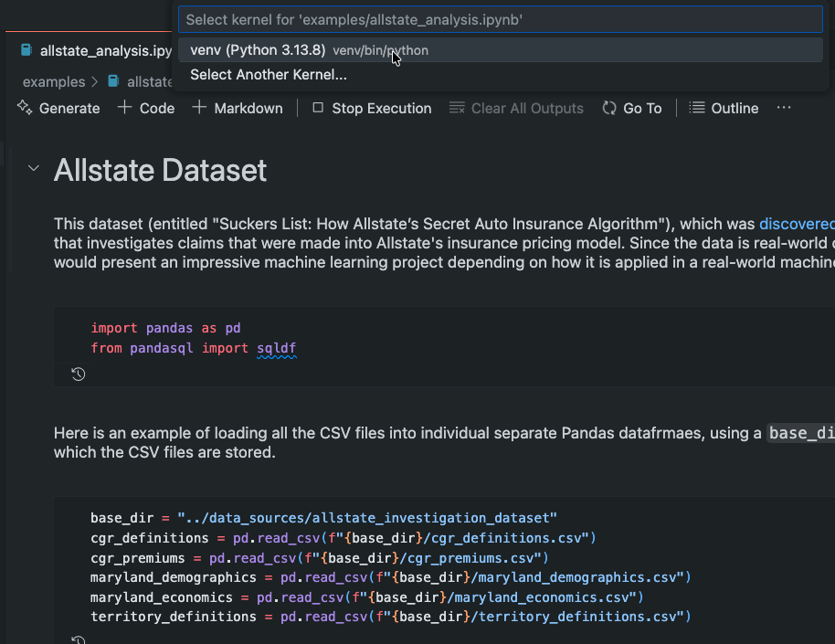
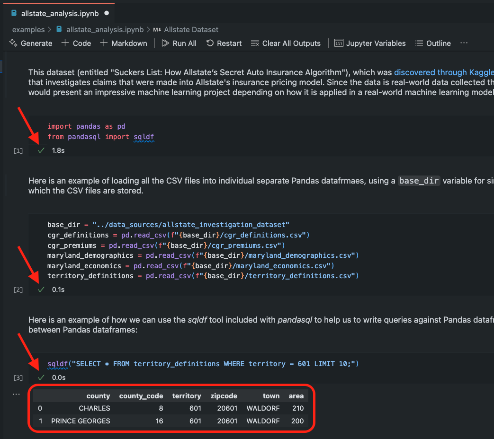

# UWGB COMP SCI 464 Group Project

In partial fulfillment for the requirements of the UW Green Bay's COMP SCI 464 – Artificial Intelligence course, our group decided to work with data specifically related to the premiums for personal lines automobile insurance policies in the United States and examine such datasets with various machine learning models and techniques. While the scope of the project has been left somewhat open-ended, our group has taken on the challenge of playing around with different models, hyperparameters, and datasets to see how accurate models can be created for the automobile insurance industry.

## Getting Started

The only true prerequisite to getting started with this project is the Python runtime and some code editing environment that supports executing Python snippets in Jupyter notebooks. While either Visual Studio Code or PyCharm are recommended for this project, other editors may work as well.

## Virtual Environment Setup and Activation

After cloning the repository, a virtual environment needs to be setup to manage the project-specific dependencies (such as NumPy, Pandas, Scikit-Learn, etc.). To do this, navigate to the root directory of the project and execute the following in the command line:

```console
$ python3 -m venv venv
```

Then, activating the virtual environment once it is created is platform-specific:

### Windows

```console
C:\Users\John Doe> venv\Scripts\activate
```

### MacOS/Linux/UNIX

```console
$ source venv/bin/activate
```

## Installing Dependencies

Once the virtual environment is activated, you can install the dependencies within that virtual environment by executing the following:

```console
pip install -r requirements.txt
```

If this is the first time running a machine learning project on your computer, this may take some time. However, once it is done you should be all ready to get started working with the Jupyter-based machine learning project.

## Getting Started with Jupyter in VSCode

If you are unfamiliar with how to work with Jupyter notebooks in VSCode, here is a quick intro (I hope you find it helpful). First, locate in your project directory for the Jupyter notebook in question. By convention, they should have the `.ipynb` file extension.



Once opened, the project can be executed by selecting the *Run All* button in the top navigation bar.



If the project was freshly opened, VSCode will ask you which virtual environment you want to select. It is important to make sure that you select the one in your `venv` directory, since this is the one that we installed our dependencies into earlier. Otherwise, the Jupyter notebook will be unable to locate certain core dependencies such as Pandas, NumPy, etc.



After executing the cells, green checkmarks should appear in each box that was executed, followed by its corresponding output (if there was any):


